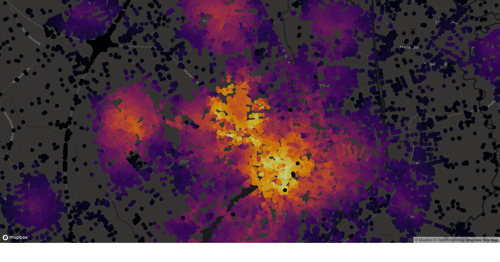
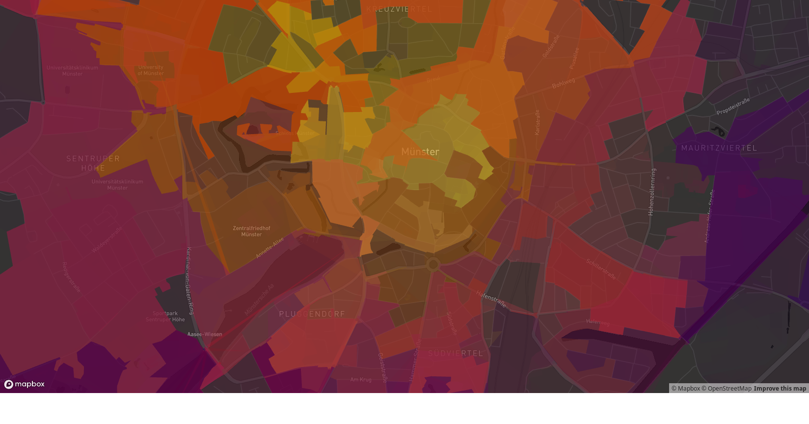

<!-- README.md is generated from README.Rmd. Please edit that file -->

[](https://travis-ci.org/moveability/moveability)
[](https://ci.appveyor.com/project/moveability/moveability)
[](https://codecov.io/gh/moveability/moveability)
[](http://www.repostatus.org/#concept)

# moveability: Forget walkability, i wanna skate

## Warning: Currently experimental only

Infrastructure to calculate comprehensive moveability statistics for a
nominated city. Moveability is intended to connote any means by which
people might actively move thenselves, primarily implying walking and
cycling, but also potentially skating, scootering, wheelchairing, or any
other conceivable form of active transport.

Currently concept-only demo only calculates walkability (and doesn’t
even do that properly just yet, but it will soon enough …)

## Usage

Currently only one function that works like this:

``` r
library (moveability)
verts <- moveability (city = "muenster germany")
```

The function does a heap of heavy work, downloading the entire street
net and calculating routes between every single pair of points in the
network. This is likely to take quite some time - at least several
minutes - but will provide progress information on the way. The result
is a `data.frame` of all points in the street network for the nominated
city, with a column `$m` quantifying walkability.

An alternative approach is to pre-download the network and submit that
to the `moveability()` function:

``` r
net <- dodgr::dodgr_streetnet (bbox = city, expand = 0.05) %>%
    dodgr::weight_streetnet (wt_profile = "foot") # or whatever
verts <- moveability (streetnet = net)
```

The result can be directly viewed with
[`mapdeck`](https://github.com/SymbolixAU/mapdeck) with the following
code:

``` r
library (mapdeck)
set_token (Sys.getenv ("MAPBOX_TOKEN"))
loc <- c (mean (verts$x), mean (verts$y))
verts$m <- 20 * verts$m / max (verts$m)
mapdeck (style = 'mapbox://styles/mapbox/dark-v9',
         zoom = 12,
         location = loc) %>%
    add_pointcloud (data = verts,
              layer_id = "walkability",
              lon = "x",
              lat = "y",
              radius = 10,
              fill_colour = "m",
              palette = "inferno")
```



or the same thing plotted as polygons of city blocks


